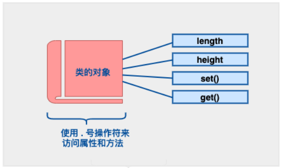

## C++ 类 & 对象
- C++ 在 C 语言的基础上增加了面向对象编程，C++ 支持面向对象程序设计。类是 C++ 的核心特性，通常被称为用户定义的类型。
- 类用于指定对象的形式，它包含了数据表示法和用于处理数据的方法。类中的数据和方法称为类的成员。函数在一个类中被称为类的成员。

### C++ 类定义
- 定义一个类，本质上是定义一个数据类型的蓝图，定义了类的对象包括了什么，以及可以在这个对象上执行哪些操作。
<table frame=void>  <!--使用table标签，且frame=void消除外边框-->
    <tr>           <!--<tr>一行的内容<\tr>，<td>一个格子的内容<\td>-->
    <td><center></center></td>   <!--<center>标签将图片居中-->
    </tr>
</table>
- 类定义后必须跟着一个分号或一个声明列表。例如，我们使用关键字 **class** 定义 Box 数据类型，如下所示：
```C++
    class Box 
    { 
	    public: 
		    double length; // 盒子的长度 
		    double breadth; // 盒子的宽度 
		    double height; // 盒子的高度 
		    
		// 成员函数声明 
		double get(void); 
		void set( double len, double bre, double hei );
	};

	// 成员函数定义 
	double Box::get(void) 
	{ 
		return length * breadth * height; 
	} 
	
	void Box::set( double len, double bre, double hei) 
	{ 
		length = len; breadth = bre; height = hei; 
	}

	int main( ) 
	{ 
		Box Box1; // 声明 Box1，类型为 Box 
		Box Box3; // 声明 Box3，类型为 Box 
		double volume = 0.0; // 用于存储体积 
		
		// box 1 详述 
		Box1.height = 5.0; 
		Box1.length = 6.0; 
		Box1.breadth = 7.0; 
		
		// box 1 的体积 
		volume = Box1.height * Box1.length * Box1.breadth; 
		cout << "Box1 的体积：" << volume <<endl; 
		
		// box 3 详述 
		Box3.set(16.0, 8.0, 12.0); 
		volume = Box3.get(); 
		cout << "Box3 的体积：" << volume <<endl; 
		
		return 0; 
	}
```
- 关键字 ==public== 确定了类成员的访问属性。在类对象作用域内，公共成员在类的外部是可访问的。

### 访问数据成员

- 需要注意的是，私有的成员和受保护的成员不能使用直接成员访问运算符 `(.)` 来直接访问。

### 类 & 对象详解
| 概念      | 描述 |
| :-------- | --- |
|[类成员函数](https://www.runoob.com/cplusplus/cpp-class-member-functions.html "C++ 类成员函数") |类的成员函数是指那些把定义和原型写在类定义内部的函数，就像类定义中的其他变量一样。 |
| [类访问修饰符](https://www.runoob.com/cplusplus/cpp-class-access-modifiers.html "C++ 类访问修饰符")  | 类成员可以被定义为 public、private 或 protected。默认情况下是定义为 private。 |
|[构造函数 & 析构函数](https://www.runoob.com/cplusplus/cpp-constructor-destructor.html "C++ 构造函数 & 析构函数") | 类的构造函数是一种特殊的函数，在创建一个新的对象时调用。类的析构函数也是一种特殊的函数，在删除所创建的对象时调用。|
| [拷贝构造函数](https://www.runoob.com/cplusplus/cpp-copy-constructor.html "C++ 拷贝构造函数") | 拷贝构造函数，是一种特殊的构造函数，它在创建对象时，是使用同一类中之前创建的对象来初始化新创建的对象。 |
| [友元函数](https://www.runoob.com/cplusplus/cpp-friend-functions.html "C++ 友元函数") | **友元函数**可以访问类的 private 和 protected 成员。|
| [内联函数](https://www.runoob.com/cplusplus/cpp-inline-functions.html "C++ 内联函数") | 通过内联函数，编译器试图在调用函数的地方扩展函数体中的代码。|
| [this 指针](https://www.runoob.com/cplusplus/cpp-this-pointer.html "C++ 中的 this 指针") | 每个对象都有一个特殊的指针 **this**，它指向对象本身。|
| [指向类的指针](https://www.runoob.com/cplusplus/cpp-pointer-to-class.html "C++ 中指向类的指针") | 指向类的指针方式如同指向结构的指针。实际上，类可以看成是一个带有函数的结构。|
| [类的静态成员](https://www.runoob.com/cplusplus/cpp-static-members.html "C++ 类的静态成员") | 类的数据成员和函数成员都可以被声明为静态的。|

## [C++ 数据封装](https://www.runoob.com/cplusplus/cpp-data-encapsulation.html)
所有的 C++ 程序都有以下两个基本要素：
-   **程序语句（代码）：** 这是程序中执行动作的部分，它们被称为函数。
-   **程序数据：** 数据是程序的信息，会受到程序函数的影响。

封装是面向对象编程中的把数据和操作数据的函数绑定在一起的一个概念，这样能避免受到外界的干扰和误用，从而确保了安全。数据封装引申出了另一个重要的 OOP 概念，即**数据隐藏**。

**数据封装**是一种把数据和操作数据的函数捆绑在一起的机制，**数据抽象**是一种仅向用户暴露接口而把具体的实现细节隐藏起来的机制。

C++ 通过创建**类**来支持封装和数据隐藏（public、protected、private）。我们已经知道，类包含私有成员（private）、保护成员（protected）和公有成员（public）成员。默认情况下，在类中定义的所有项目都是私有的。例如：
```C++
class Box 
{ 
	public: 
		double getVolume(void) { return length * breadth * height; } 
	private: 
		double length; // 长度 
		double breadth; // 宽度 
		double height; // 高度 
};
```
变量 length、breadth 和 height 都是私有的（private）。这意味着它们只能被 Box 类中的其他成员访问，而不能被程序中其他部分访问。这是实现封装的一种方式。

为了使类中的成员变成公有的（即，程序中的其他部分也能访问），必须在这些成员前使用 **public** 关键字进行声明。所有定义在 public 标识符后边的变量或函数可以被程序中所有其他的函数访问。

把一个类定义为另一个类的友元类，会暴露实现细节，从而降低了封装性。理想的做法是尽可能地对外隐藏每个类的实现细节。
```C++
#include <iostream> 
using namespace std; 
class Adder
{ 
	public: 
	// 构造函数 
	Adder(int i = 0) { total = i; } 
	// 对外的接口 
	void addNum(int number) { total += number; } 
	// 对外的接口 
	int getTotal() { return total; }; private: 
	// 对外隐藏的数据 
	int total; 
}; 

int main( ) 
{ 
	Adder a; 
	a.addNum(10); 
	a.addNum(20); 
	a.addNum(30); 
	cout << "Total " << a.getTotal() <<endl; return 0; 
}
```
- 上面的类把数字相加，并返回总和。公有成员 **addNum** 和 **getTotal** 是对外的接口，用户需要知道它们以便使用类。私有成员 **total** 是对外隐藏的，用户不需要了解它，但它又是类能正常工作所必需的。


## [C++ 继承](https://www.runoob.com/cplusplus/cpp-inheritance.html)
- 继承允许我们依据另一个类来定义一个类，这使得创建和维护一个应用程序变得更容易。这样做，也达到了重用代码功能和提高执行效率的效果。

- 当创建一个类时，您不需要重新编写新的数据成员和成员函数，只需指定新建的类继承了一个已有的类的成员即可。这个已有的类称为**基类**，新建的类称为**派生类**。
	`class derived-class: access-specifier base-class`
其中，访问修饰符 access-specifier 是 **public、protected** 或 **private** 其中的一个，base-class 是之前定义过的某个类的名称。如果未使用访问修饰符 access-specifier，则默认为 private。

- 继承代表了 **is a** 关系。例如，哺乳动物是动物，狗是哺乳动物，因此，狗是动物，等等。
``` C++
#include <iostream> 
using namespace std; 

// 基类 
class Shape 
{ 
	public: 
	void setWidth(int w) { width = w; } 
	void setHeight(int h) { height = h; } 
	protected: 
		int width; 
		int height; 
}; 

// 派生类 
class Rectangle: public Shape 
{ 
	public: 
		int getArea() { return (width * height); } 
}; 

int main(void) 
{ 
	Rectangle Rect; 
	Rect.setWidth(5); 
	Rect.setHeight(7); 
	// 输出对象的面积 
	cout << "Total area: " << Rect.getArea() << endl; return 0; 
}
```


## [C++ 多态](https://www.runoob.com/cplusplus/cpp-polymorphism.html)
- **多态**按字面的意思就是多种形态。当类之间存在层次结构，并且类之间是通过继承关联时，就会用到多态。
- C++ 多态意味着调用成员函数时，会根据调用函数的对象的类型来执行不同的函数。
- 下面的实例中，基类 Shape 被派生为两个类，如下所示：
```C++
#include <iostream> 
using namespace std; 
class Shape 
{ 
	protected: 
	int width, height; 
	public: 
	Shape( int a=0, int b=0) { width = a; height = b; } 
	int area() { cout << "Parent class area :" <<endl; return 0; } 
}; 
class Rectangle: public Shape
{ 
	public: 
		Rectangle( int a=0, int b=0):Shape(a, b) { } 
		int area () { cout << "Rectangle class area :" <<endl; return (width * height); } 
}; 
class Triangle: public Shape
{ 
	public: Triangle( int a=0, int b=0):Shape(a, b) { } 
	int area () { cout << "Triangle class area :" <<endl; return (width * height / 2); } 
}; 

// 程序的主函数 
int main( ) 
{ 
	Shape *shape; 
	Rectangle rec(10,7); 
	Triangle tri(10,5); 
	
	// 存储矩形的地址 
	shape = &rec; 
	// 调用矩形的求面积函数 
	area shape->area();
	// 存储三角形的地址 
	shape = &tri; 
	// 调用三角形的求面积函数 
	area shape->area(); 
	
	return 0; 
}
```
输出：
```C++
Parent class area :
Parent class area :
```
导致错误输出的原因是，调用函数 area() 被编译器设置为基类中的版本，这就是所谓的**静态多态**，或**静态链接** - 函数调用在程序执行前就准备好了。有时候这也被称为**早绑定**，因为 area() 函数在程序编译期间就已经设置好了。

但现在，让我们对程序稍作修改，在 Shape 类中，area() 的声明前放置关键字 **virtual**，如下所示：
```c++
class Shape 
{ 
	protected: 
		int width, height; 
	public: 
		Shape( int a=0, int b=0) { width = a; height = b; } 
		virtual int area() { cout << "Parent class area :" <<endl; return 0; } 
};
```
输出：
```c++
Rectangle class area :
Triangle class area :
```
- 此时，编译器看的是指针的内容，而不是它的类型。因此，由于 tri 和 rec 类的对象的地址存储在 *shape 中，所以会调用各自的 area() 函数。*  
- 每个子类都有一个函数 area() 的独立实现。这就是**多态**的一般使用方式。
- 有了多态，就可有多个不同的类，都带有同一个名称但具有不同实现的函数，函数的参数甚至可以是相同的。
- **虚函数** 是在基类中使用关键字 **virtual** 声明的函数。在派生类中重新定义基类中定义的虚函数时，会告诉编译器不要静态链接到该函数。我们想要的是在程序中任意点可以根据所调用的对象类型来选择调用的函数，这种操作被称为**动态链接**，或**后期绑定**。
