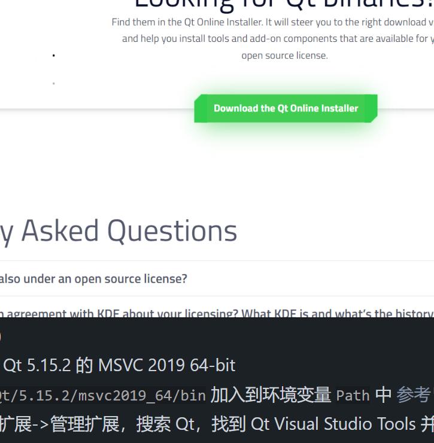

## QT 安装与配置

-   要求 VS 2019
-   打开[官网](https://www.qt.io/)
-   点击右上角的 "Download. Try. Buy"
-   点击 "Downloads for open sources users" 的 "Go open source"，拉到最下进行下载

安装（此时需要登录)
-   打开下载器，选择 Qt 5.15.2 的 MSVC 2019 64-bit
-   将 `YOUR_PATH_TO/Qt/5.15.2/msvc2019_64/bin` 加入到环境变量 `Path` 中 [参考](https://blog.csdn.net/weixin_37204973/article/details/82504570)
-   VS 2019 菜单栏->扩展->管理扩展，搜索 Qt，找到 Qt Visual Studio Tools 并安装
- 安装好后会需要退出 VS，再次打开 VS 该工具以便在 VS 中打开 *.qrc 和 *.ui 文件时可以自动打开 Qt Resource Editor 和 Qt Designer
-   安装 Qt Visual Studio Tools 成功后，重启 VS，菜单栏->扩展->Qt VS Tool->Qt Options，在弹出的窗口中
    -   Qt Versions 下选择 Add，添加 path 为 `YOUR_PATH_TO/Qt/5.15.2/msvc2019_64/bin/`内的默认的 .exe 文件
    - 添加指定动态库 [参考](https://blog.csdn.net/HHT0506/article/details/90041826)
    - 检查 QT-Project-Setting 是否正确 [参考](https://blog.csdn.net/jiaolu295/article/details/116116186)

- 注意，需使用 debug 模式运行所给的 .sln 解决方案！！！

